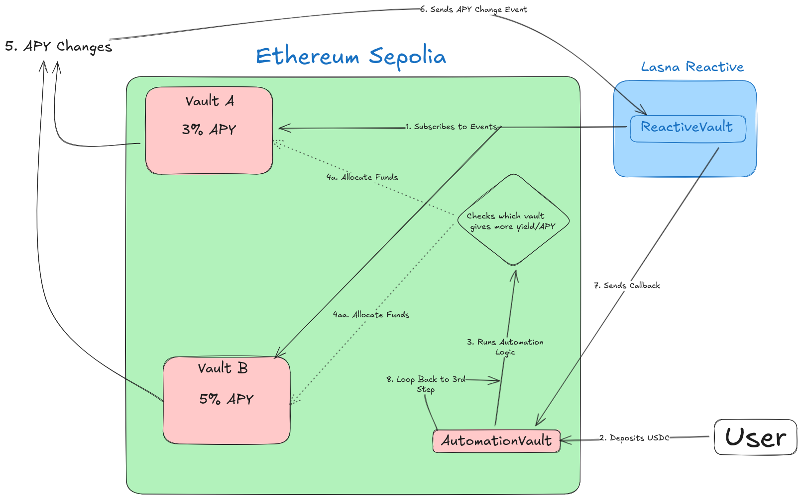

# Vaultus

A cross-chain lending automation vault built with Reactive Smart Contracts that monitors multiple lending pools and automatically rebalances liquidity based on yield signals.

## Table of Contents

- [Overview](#overview)
- [Problem Statement](#problem-statement)
- [Why Reactive Contracts](#why-reactive-contracts)
- [Architecture](#architecture)
- [Contract Addresses](#contract-addresses)
- [Setup](#setup)
- [Deployment](#deployment)
- [Workflow](#workflow)
- [Transaction Hashes](#transaction-hashes)
- [Testing](#testing)
- [Security Considerations](#security-considerations)
- [Trade-offs](#trade-offs)

---

## Overview

This project implements an automated yield optimization vault that:

1. Provides a single deposit interface for users
2. Monitors APY changes across two lending pools in real-time
3. Automatically rebalances funds to the higher-yielding pool
4. Uses Reactive Smart Contracts to enable cross-chain event monitoring and automation

Users deposit once into the AutomationVault. The system continuously monitors APY changes on both lending pools via Reactive Network and automatically moves funds to maximize yield.

---

## Problem Statement

DeFi users seeking optimal yields face several challenges:

1. **Manual Monitoring**: Users must constantly monitor APY rates across multiple protocols
2. **Gas Costs**: Frequent manual rebalancing incurs significant gas costs
3. **Timing**: Users often miss optimal rebalancing opportunities due to delayed reactions
4. **Complexity**: Managing positions across multiple pools requires technical expertise

Traditional solutions require either:
- Centralized keepers (trust assumptions, single point of failure)
- Off-chain bots (infrastructure overhead, reliability concerns)
- Manual intervention (time-consuming, suboptimal)

---

## Why Reactive Contracts

Reactive Smart Contracts solve these problems in ways that are difficult or impossible with traditional approaches:

### Without Reactive Contracts

| Approach | Problems |
|----------|----------|
| Centralized Keeper | Single point of failure, trust assumptions, can be censored |
| Off-chain Bot | Requires 24/7 infrastructure, can miss events, latency issues |
| Chainlink Automation | Cost per execution, limited customization, dependency on oracle |
| Manual Rebalancing | Human error, delayed reactions, not scalable |

### With Reactive Contracts

| Benefit | Description |
|---------|-------------|
| Trustless Automation | No centralized party controls the rebalancing |
| Event-Driven | Reacts immediately when APY changes occur on-chain |
| No Infrastructure | No servers, bots, or keepers to maintain |
| Cost-Effective | Only executes when conditions are met |
| Composable | Can integrate with any EVM chain supported by Reactive Network |

The ReactiveVault subscribes to `Vault__APYUpdated` events on the origin chain. When an APY change is detected, the Reactive Network automatically executes the `react()` function, which evaluates conditions and emits a callback to trigger rebalancing on the destination chain. This entire flow is trustless, permissionless, and requires no off-chain infrastructure.

---

## Architecture

### System Components

```
+-----------------------------------------------------------------------------------+
|                              SYSTEM ARCHITECTURE                                  |
+---------------------------------------+-------------------------------------------+
|           ETHEREUM SEPOLIA            |         REACTIVE NETWORK (LASNA)          |
+---------------------------------------+-------------------------------------------+
|                                       |                                           |
|  +-------------+    +-------------+   |   +-----------------------------------+   |
|  |   Vault A   |    |   Vault B   |   |   |          ReactiveVault            |   |
|  |   (Pool)    |    |   (Pool)    |   |   |                                   |   |
|  |             |    |             |   |   |  - Subscribes to APY events       |   |
|  |  Base: 3%   |    |  Base: 5%   |   |   |  - Monitors both vaults           |   |
|  |  Slope: 10% |    |  Slope: 15% |   |   |  - Emits Callback on APY change   |   |
|  |             |    |             |   |   |                                   |   |
|  |  Emits:     |    |  Emits:     |   |   +-----------------------------------+   |
|  |  APYUpdated |    |  APYUpdated |   |                                           |
|  +------+------+    +------+------+   |                                           |
|         |                 |           |                                           |
|         +--------+--------+           |                                           |
|                  |                    |                                           |
|                  v                    |                                           |
|  +-------------------------------+    |                                           |
|  |       AutomationVault         |    |                                           |
|  |                               |    |                                           |
|  |  - Single entry for users     |    |                                           |
|  |  - Receives APY callbacks     |    |                                           |
|  |  - Tracks pool APYs           |    |                                           |
|  |  - Auto-allocates deposits    |    |                                           |
|  |  - Rebalances when threshold  |    |                                           |
|  |    exceeded (default 1%)      |    |                                           |
|  +-------------------------------+    |                                           |
|                                       |                                           |
|  +-------------------------------+    |                                           |
|  |   Callback Proxy (System)     |    |                                           |
|  |   Relays callbacks from RVM   |    |                                           |
|  +-------------------------------+    |                                           |
|                                       |                                           |
+---------------------------------------+-------------------------------------------+
```

### Workflow Diagram



---

## Contract Addresses

### Ethereum Sepolia (Chain ID: 11155111)

| Contract | Address | Description |
|----------|---------|-------------|
| Vault A | `0x6a7dDE37847AfA41950A0380b83eF59f987DeEbB` | Lending pool with 3% base APY |
| Vault B | `0xb91D02C48903f2c26aF27526DA1e473FD91EaE49` | Lending pool with 5% base APY |
| AutomationVault | `0xb8EdE2D65EA52022FceC99DC5b76C67BE01332E2` | User-facing vault, receives callbacks |
| USDC | `0x1c7D4B196Cb0C7B01d743Fbc6116a902379C7238` | Test USDC token |
| Callback Proxy | `0xc9f36411C9897e7F959D99ffca2a0Ba7ee0D7bDA` | Reactive Network system contract |

### Reactive Network Lasna (Chain ID: 5318007)

| Contract | Address | Description |
|----------|---------|-------------|
| ReactiveVault | `0x5F29634A650b8518603715B9393aA87DF42e0f56` | Monitors APY events, emits callbacks |
| System Contract | `0x0000000000000000000000000000000000fffFfF` | Reactive Network service contract |

---

## Setup

### Prerequisites

- [Foundry](https://book.getfoundry.sh/getting-started/installation)
- [Node.js](https://nodejs.org/) v18+
- Git

### Clone Repository

```bash
git clone https://github.com/10234567Z/Vaultus.git
cd Vaultus
```

### Install Dependencies

```bash
# Install contract dependencies
cd contracts
forge install

# Install frontend dependencies
cd ../frontend
npm install
```

### Environment Variables

Create a `.env` file in the `contracts` directory:

```bash
# contracts/.env
PRIVATE_KEY=your_private_key_here
SEPOLIA_RPC=https://eth-sepolia.g.alchemy.com/v2/YOUR_API_KEY
```

Create a `.env` file in the `frontend` directory:

```bash
# frontend/.env
NEXT_PUBLIC_VAULT_A_ADDRESS=0x6a7dDE37847AfA41950A0380b83eF59f987DeEbB
NEXT_PUBLIC_VAULT_B_ADDRESS=0xb91D02C48903f2c26aF27526DA1e473FD91EaE49
NEXT_PUBLIC_AUTOMATION_VAULT_ADDRESS=0xb8EdE2D65EA52022FceC99DC5b76C67BE01332E2
NEXT_PUBLIC_USDC_ADDRESS=0x1c7D4B196Cb0C7B01d743Fbc6116a902379C7238
```

---

## Deployment

### Step 1: Deploy Origin Contracts (Vault A and Vault B)

```bash
cd contracts

# Deploy Vault A (3% base APY)
forge create --broadcast --rpc-url $SEPOLIA_RPC --private-key $PRIVATE_KEY \
  src/Vault.sol:Vault \
  --constructor-args $DEPLOYER_ADDRESS 0x1c7D4B196Cb0C7B01d743Fbc6116a902379C7238 300 1000 10000000000

# Deploy Vault B (5% base APY)
forge create --broadcast --rpc-url $SEPOLIA_RPC --private-key $PRIVATE_KEY \
  src/Vault.sol:Vault \
  --constructor-args $DEPLOYER_ADDRESS 0x1c7D4B196Cb0C7B01d743Fbc6116a902379C7238 500 1500 10000000000
```

### Step 2: Deploy Destination Contract (AutomationVault)

```bash
forge create --broadcast --rpc-url $SEPOLIA_RPC --private-key $PRIVATE_KEY \
  src/AutomationVault.sol:AutomationVault \
  --value 0.02ether \
  --constructor-args \
    0x1c7D4B196Cb0C7B01d743Fbc6116a902379C7238 \
    <VAULT_A_ADDRESS> \
    <VAULT_B_ADDRESS> \
    0xc9f36411C9897e7F959D99ffca2a0Ba7ee0D7bDA \
    30
```

Constructor arguments:
1. `_asset`: USDC address
2. `_poolA`: Vault A address
3. `_poolB`: Vault B address
4. `_callbackProxy`: Reactive callback proxy on Sepolia
5. `_minRebalanceInterval`: Minimum seconds between rebalances

### Step 3: Deploy Reactive Contract (ReactiveVault)

```bash
forge create --broadcast --rpc-url https://lasna-rpc.rnk.dev/ --private-key $PRIVATE_KEY \
  src/ReactiveVault.sol:ReactiveVault \
  --value 0.1ether \
  --constructor-args \
    0x0000000000000000000000000000000000fffFfF \
    11155111 \
    11155111 \
    <VAULT_A_ADDRESS> \
    <VAULT_B_ADDRESS> \
    <AUTOMATION_VAULT_ADDRESS> \
    100
```

Constructor arguments:
1. `_service`: Reactive Network system contract
2. `_originChainId`: Sepolia chain ID (11155111)
3. `_destinationChainId`: Sepolia chain ID (11155111)
4. `_vaultA`: Vault A address on Sepolia
5. `_vaultB`: Vault B address on Sepolia
6. `_automationVault`: AutomationVault address on Sepolia
7. `_rebalanceThreshold`: APY difference threshold in basis points (100 = 1%)

### Alternative: Deploy Full System with Script

```bash
cd contracts
forge script script/DeployVault.s.sol:DeployVault --rpc-url $SEPOLIA_RPC --broadcast
```

---

## Workflow

### Step-by-Step Operation

1. **Deployment**: All contracts are deployed. ReactiveVault subscribes to `Vault__APYUpdated` events from Vault A and Vault B.

2. **User Deposit**: User approves USDC and calls `AutomationVault.deposit(amount)`. The vault checks current APYs and allocates funds to the higher-yielding pool.

3. **APY Monitoring**: ReactiveVault on Lasna continuously monitors for `Vault__APYUpdated` events on Sepolia.

4. **Event Detection**: When deposits/withdrawals occur in Vault A or B, they emit `Vault__APYUpdated(oldAPY, newAPY)` events.

5. **Reactive Execution**: The Reactive Network detects the event and executes `ReactiveVault.react(log)`. The function decodes the APY data and emits a `Callback` event.

6. **Callback Delivery**: Reactive Network delivers the callback to AutomationVault on Sepolia via the Callback Proxy.

7. **APY Update**: `AutomationVault.updateAPY(sender, vault, newApy)` is called, updating the tracked APY for that vault.

8. **Rebalance Check**: AutomationVault checks if the APY difference exceeds the threshold (default 1%). If yes, and if `minRebalanceInterval` has passed, it triggers a rebalance.

9. **Rebalance Execution**: Funds are withdrawn from the lower-APY pool and deposited into the higher-APY pool.

10. **Continuous Loop**: The system continues monitoring. Any future APY changes trigger the same flow.

---

## Transaction Hashes

### Deployment Transactions

| Step | Chain | Description | Transaction Hash |
|------|-------|-------------|------------------|
| 1 | Sepolia | Deploy Vault A | [`0xd876ed2192c545b9bd80845f7d12467c022c6dcbcd3a1ddd8cc6e7ea8e30bfe4`](https://sepolia.etherscan.io/tx/0xd876ed2192c545b9bd80845f7d12467c022c6dcbcd3a1ddd8cc6e7ea8e30bfe4) |
| 2 | Sepolia | Deploy Vault B |[ `0xe4de0b5a4b9b4375170219c6f3ef28172690931e1f1660b588bf8b54a9b3fc60`](https://sepolia.etherscan.io/tx/0xe4de0b5a4b9b4375170219c6f3ef28172690931e1f1660b588bf8b54a9b3fc60) |
| 3 | Sepolia | Deploy AutomationVault | [`0x42440456c9773285fc97b51bc3cbd72bff76ea3d50e7620060e3b58e50c1e367`](https://sepolia.etherscan.io/tx/0x42440456c9773285fc97b51bc3cbd72bff76ea3d50e7620060e3b58e50c1e367) |
| 4 | Lasna | Deploy ReactiveVault | [`0x73ccf9c6677ca4034fb3e398f926e8848b9ee354124c4b6cda93c4d7eb429533`](https://lasna.reactscan.net/address/0x69e135540f4f5b69592365dfe7730c08ace96ccb/32) |

### Workflow Demonstration Transactions

| Step | Chain | Description | Transaction Hash |
|------|-------|-------------|------------------|
| 5 | Sepolia | User deposits to AutomationVault | [`0x610ef8b3eff2d7c75e88fca2a0c5b739cae36ea3742c3a3718eb96b355b78d01`](https://sepolia.etherscan.io/tx/0x610ef8b3eff2d7c75e88fca2a0c5b739cae36ea3742c3a3718eb96b355b78d01) |
| 6 | Sepolia | Vault__APYUpdated event emitted | (Included in deposit tx above) |
| 7 | Lasna | ReactiveVault.react() executed | [`0xa505915e5ee205b1ea38e1c9702986d1438379f1d60852bf2030c80cbff41122`](https://lasna.reactscan.net/address/0x69e135540f4f5b69592365dfe7730c08ace96ccb/78) |
| 8 | Lasna | Callback event emitted | (Included in react tx above) |

### Verification Links

- Sepolia Etherscan: `https://sepolia.etherscan.io/`
- Lasna Reactscan: `https://lasna.reactscan.net/`
- ReactiveVault on Reactscan: `https://lasna.reactscan.net/address/0x5F29634A650b8518603715B9393aA87DF42e0f56`

---

## Testing

### Run All Tests

```bash
cd contracts
forge test -vv
```

### Test Output

```
Ran 43 tests for 2 test suites
- VaultTest: 20 tests passed
- AutomationVaultTest: 23 tests passed
```

### Test Coverage

The test suite covers:

- Constructor validation and parameter setting
- Deposit and withdrawal functionality
- APY calculation based on utilization
- Callback authorization (only callback proxy can call)
- APY update handling from ReactiveVault
- Automatic rebalancing when threshold exceeded
- Pause/unpause functionality
- Owner-only administrative functions
- Edge cases and fuzz testing

---

## Security Considerations

### Threat Model

| Threat | Mitigation |
|--------|------------|
| Unauthorized callbacks | `authorizedSenderOnly` modifier ensures only Callback Proxy can call `updateAPY()` |
| Reentrancy attacks | `ReentrancyGuard` on all external functions |
| Flash loan manipulation | `minRebalanceInterval` prevents rapid repeated rebalancing |
| Price/APY manipulation | APY is calculated from actual deposits, not external oracles |
| Centralization risk | No admin can withdraw user funds; only pause/unpause |
| ReactVM state persistence | ReactVM is stateless; all state tracking happens on Sepolia |

### Access Control

- `AutomationVault`: Owner can pause/unpause, set parameters. Cannot access user funds.
- `ReactiveVault`: Owner can pause/resume subscriptions, set threshold.
- `Vault A/B`: Owner is set at deployment. Standard vault operations only.

### Invariants

1. Total user shares always correspond to total deposited assets
2. Allocations (allocationA + allocationB) always equal total assets in pools
3. Rebalancing only occurs when APY difference exceeds threshold
4. Only authorized senders (Callback Proxy) can trigger callbacks

---

## Trade-offs

### Design Decisions

| Decision | Trade-off |
|----------|-----------|
| Single destination chain | Simpler architecture, but limits to one chain for rebalancing |
| Immediate rebalancing | Maximizes yield, but incurs gas on every threshold breach |
| Share-based accounting | Accurate user balances, but adds complexity |
| Stateless ReactVM | Requires destination chain to track APYs, but follows Reactive best practices |
| Fixed rebalance threshold | Predictable behavior, but not adaptable to market conditions |

### Limitations

1. **Single Asset**: Currently only supports USDC. Could be extended to multiple assets.
2. **Two Pools**: Monitors exactly two pools. Could be extended to N pools.
3. **Same Chain**: Origin and destination are both Sepolia. Could support cross-chain.
4. **No Yield Claiming**: Vaults track deposits but don't distribute yield. Production version would need yield accounting.

### Future Improvements

- Multi-asset support
- Cross-chain rebalancing (e.g., Sepolia to Arbitrum)
- Dynamic threshold adjustment based on gas costs
- Integration with real lending protocols (Aave, Compound)
- Yield distribution to depositors

---

## Repository Structure

```
Vaultus/
├── contracts/
│   ├── src/
│   │   ├── Vault.sol              # Lending pool contract
│   │   ├── AutomationVault.sol    # User-facing vault with rebalancing
│   │   └── ReactiveVault.sol      # Reactive contract on Lasna
│   ├── test/
│   │   ├── Vault.t.sol            # Vault unit tests
│   │   └── AutomationVault.t.sol  # AutomationVault tests
│   ├── script/
│   │   └── DeployVault.s.sol      # Deployment script
│   └── foundry.toml
├── frontend/
│   ├── app/
│   │   ├── page.tsx               # Main UI
│   │   ├── contracts.ts           # Contract addresses and ABIs
│   │   └── providers.tsx          # Web3 providers
│   └── package.json
└── README.md
```

---

## License

MIT

---

## Links

- [Reactive Network Documentation](https://dev.reactive.network/)
- [Reactive Network Testnet (Lasna)](https://lasna.reactscan.net/)
- [Sepolia Etherscan](https://sepolia.etherscan.io/)
- [Project Repository](https://github.com/10234567Z/Vaultus)
